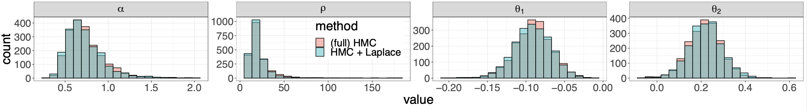
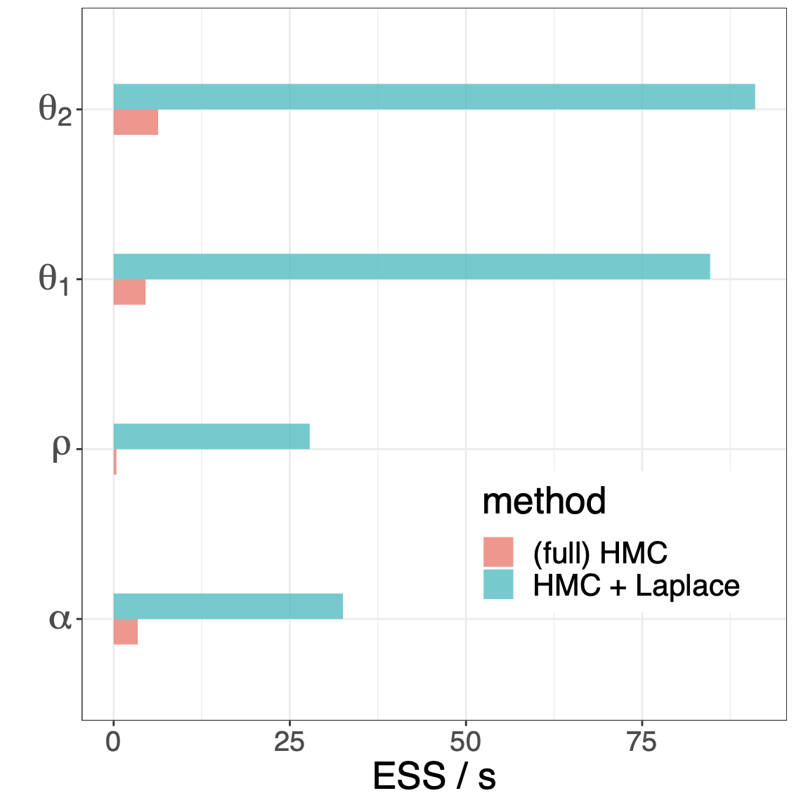

```{r setup, include=FALSE}
knitr::opts_chunk$set(echo = TRUE)
```

## Introduction {-#Introduction}

Latent Gaussian models are a class of hierarchical models 
that put a normal prior on the latent variable. Their general form is
\begin{equation}
\begin{split}
  \phi & \sim \pi(\phi), \\
  \theta & \sim \mathrm{Normal}(0, K(\phi)), \\
  y & \sim \pi(y \mid \theta, \phi),
\end{split}
(\#eq:lgm)
\end{equation}
where $y$ denotes the observations, $\theta$ the _latent variable_,
and $\phi$ the remaining unobserved variables in the model.
Bearing a slight abuse of language, we will call $\phi$ the _hyperparameters_.
Typically, single observations $y_i$ are independently distributed and only
depend on a linear combination of the latent variables, that is
$\pi(y_i \mid \theta, \phi) = \pi(y_i \mid a^T_i \theta , \phi)$
for some appropriate vector $a$.
In many applications, $\theta_j$ denotes a group parameter
that informs the distribution of observations in group $j$.
Latent Gaussian models find a broad range of applications;
and because of their normal prior are subject to convenient mathematical
manipulations that can improve Bayesian inference.

Markov chains Monte Carlo (MCMC) sampling can struggle with the geometry
induced by such models, for instance when dealing with funnel shapes,
and more generally high curvature densities
[@Neal:2003; @Betancourt:2013].
Much of the geometric grief we experience comes from the interaction
between $\phi$ and $\theta$.

An alternative approach to MCMC is to marginalize out $\theta$,
$$
  \pi(y \mid \phi) = \int \mathrm \pi(y \mid \theta, \phi) d \theta,
$$
and perform standard inference on $\phi$.
If the likelihood, $\pi(y \mid \theta, \phi)$, is non-Gaussian,
exact marginalization is not possible.
Instead, we can use an _embedded Laplace approximation_,
and compute an approximate marginal distribution, $\pi_\mathcal{G}(y \mid \phi)$.
This is the driving principle behind the packages
INLA [@Rue:2017; @Rue:2009], GPStuff [@Vanhatalo:2013],
and TMB [@Kristensen:2016].
We now incorporate these ideas in Stan,
notably building on the algorithmic work by @Rasmussen:2006.

Why Stan? To perform inference on $\phi$, we want to use Stan's dynamic HMC,
as opposed to more standard
techniques, such as numeric quadrature.
This allows us to tackle the case where $\phi$ is high-dimensional
and has a non-unimodal posterior distribution.

Embedding the Laplace approximation inside Stan's architecture
presents several technical challenges.
Anecdotally, our first implementation of the Laplace approximation
took $\sim$ 2,000 seconds to evaluate and differentiate
the approximate log marginal density
(for a certain test problem).
The current implementation performs the same task in $\sim$ 0.1 second.
The main technical innovation of our implementation 
is an _adjoint-differentiation method_,
which can handle any covariance matrix, $K$,
and scales when $\phi$ is high-dimensional [@Margossian:2020].


### Installation {-#inst}

The functions we use in this notebook are prototypes
and currently not part of Stan's release version.
In order to use them, we must first install the correct branch of Stan.
On Mac, this can be done by running the `install.sh` script,
in the `script` directory, from a terminal window:
```
cd script
./install.sh
```
The script produces a CmdStan and a Stanc3 folder with all the requisite code.
It does not install RStan or PyStan.
Instead, we will use [CmdStanR](https://mc-stan.org/cmdstanr/),
a lightweight wrapper for CmdStan,
in order to interface Stan with R.

### R setup {-#h}

The full R code can be found in `script/run_models.r`.

```{r message = FALSE}
set.seed(1954)
.libPaths("~/Rlib")  # Adjust to your setting!
library(parallel)
library(rstan)       # Use to read in data and for post-hoc analysis.
library(cmdstanr)    # Use to compile and fit the model.
# Set the path to the cmdstan directory installed with install.sh
set_cmdstan_path("script/cmdstan")
library(ggplot2)
```


## Gaussian variables (hiding in the wild) {-#lgm}

To begin, let us examine two examples of a latent Gaussian model.


### Example 1: sparse linear regression {-#example1}

Consider the following linear regression model
\begin{eqnarray*}
  \phi & \sim & \pi(\phi),  \\
  \beta & \sim & \mathrm{Normal}(0, \Sigma(\phi))  \\
  y & \sim & \pi(y \mid X \beta),
\end{eqnarray*}
where $X$ is a design matrix and $\beta$ the regression coefficients.
The prior on $\beta$ may, for example, be a sparsity inducing prior.
The above data generating process has a latent Gaussian model structure.
Observe that each observation $y_i$ depends on a linear combination
of the latent variables, $\sum_j x_{ij} \beta_j$. 

We can reformulate this model by introducing another latent Gaussian variable,
$\theta = X \beta$.
Now, $y_i$ only depends on $\theta_i$, and the model is
\begin{eqnarray*}
  \phi & \sim & \pi(\phi),  \\
  \theta & \sim & \mathrm{Normal}(0, X \Sigma(\phi) X^T),  \\
  y & \sim & \pi(y \mid \theta).
\end{eqnarray*}
Both formulations are of interest.
The first one is more natural, and emphasizes $\beta$,
presumably a variable of interest.
The benefit of the second formulation is mostly technical:
the likelihood $\pi(y \mid \theta)$, as well as its higher-order derivatives,
are easier to manipulate.


### Example 2: Gaussian process {-#example2}

The $\theta$'s in equation \@ref(eq:lgm) can be the realizations of a Gaussian process -- a non-parametric function --,
which then inform the observational distribution of $y$.
For an introduction to the subject in Stan, see @Trangucci:2017 and @Betancourt_gp:2017.
Quite remarkably, to model a Gaussian process, it suffices to study a finite number of realizations,
which follow a normal distribution
$$
  \theta \sim \mathrm{Normal}(0, K(\phi)).
$$
Roughly speaking, the covariance, $K$, controls how quickly and how much
the Gaussian process varies.
A classic example for $K$ is the squared exponential kernel, with $(i, j)^\mathrm{th}$ element defined as
$$
  K_{ij} = \alpha^2 \exp \left ( - \frac{||x_i - x_j||^2}{\rho^2} \right )
$$
where $x_i$ designates the coordinate of observation $y_i$.
In certain applications, $K$ takes a much less trivial form, e.g. [@Agrawal:2019].
The hyperparameter in this example comprises $\alpha$ and $\rho$,
for which we can construct appropriate priors.

Typically, $\pi(y_i \mid \theta, \phi) = \pi(y_i \mid \theta_i, \phi)$,
meaning that for each observation, the model includes a latent variable.
There is no formal constraint on the likelihood.
Some examples:

(i) $\pi(y_i \mid \theta_i, \phi) = \mathrm{Normal}(\theta_i, \sigma^2)$
(ii) $\pi(y_i \mid \theta_i, \phi) = \mathrm{Poisson} \left ( \exp \theta_i \right)$
(iii) $\pi(y_i \mid \theta_i, \phi) = \mathrm{Bernoulli} ( \mathrm{logit} \theta_i)$


## Tools for Bayesian inference {-#bayesian}

Our goal is to characterize the posterior distribution
$$
  \pi(\theta, \phi \mid y).
$$
A tool of choice is Markov chains Monte Carlo (MCMC),
and in particular the dynamic Hamiltonian Monte Carlo (HMC) sampler
provided by Stan [@Betancourt:2018; @Hoffman:2014].

MCMC has been widely successful in this setting
but there are nevertheless known challenges when fitting
multilevel models.
The interaction between $\phi$ and $\theta$ can indeed create complicated
geometries, such as funnel shapes.
When the Markov chain cannot overcome these geometric pathologies,
we observe divergent transitions, indicating our inference may be bias.
We can often bypass these issues by reparameterizing the model
and fine-tuning HMC.
But this process can be cumbersome, especially when working on
computationally intensive models.
Finding an acceptable parameterization and properly tuning HMC
usually requires multiple fits,
and the burden is that much more important when each fit takes
several hours.
One example is the prostate cancer classification model discussed 
by [@Piironen:2017] and [@Margossian:2020].

Given much of our geometric grief comes from the interaction
between $\theta$ and $\phi$, it stands to reason that
we may alleviate these issues by marginalizing out $\theta$
and computing
$$
  \pi(\phi \mid y) = \int \pi(\theta, \phi \mid y) \mathrm d \theta.
$$
We can then run MCMC, or any standard inference technique, on $\phi$.
It is furthermore possible to recover samples for $\theta$,
if we can construct the conditional distribution
$$
  \pi(\theta \mid \phi, y).
$$

Unfortunately, in all but a few simple cases 
we cannot calculate $\pi(\phi \mid y)$ and $\pi(\theta \mid \phi, y)$.
However, exploiting the fact $\theta$ has a normal prior,
we can approximate these distributions using a Laplace approximation.

### Exact Marginalization {-#a}

Let us now return to the Gaussian process we previously introduced.
Suppose that the observational distribution is normal,
with the $y_i$'s independent and each only depending on $\theta_i$.
That is
\begin{eqnarray*}
  \pi(\theta \mid \phi) & = & \mathrm{Normal}(0, K(\phi)),  \\
  \pi(y \mid \theta, \phi) & = & \mathrm{Normal}(\theta, \sigma^2 I),
\end{eqnarray*}
where $I$ is the identity matrix.
Then
$$
  \pi(y_i \mid \phi) = \mathrm{Normal}(0, K(\phi) + \sigma^2 I).
$$
Using an argument of conjugacy,
<!-- CHECK ME -->
$$
  \pi(\theta \mid y, \phi) = \mathrm{Normal}
    \left ( \left(K^{-1} + \frac{n}{\sigma^2} I \right)^{-1}
      \frac{1}{\sigma^2} y, 
      \left(K^{-1} + \frac{n}{\sigma^2} I \right)^{-1}
      \right).
$$

These equations motivate the following approach to fit these models in Stan.

1. run HMC on $\phi$, by encoding $\pi(\phi)$ and $\pi(y \mid \phi)$
  in the `model` block.
2. in `generated quantities`, sample $\theta$ 
  from $\pi(\theta \mid y, \phi)$.

Efficient Stan code for this procedure can be found in the case study
by @Betancourt_gp:2017.

What have we gain from doing this?
The main benefit is that MCMC now only explores the parameter space
of $\phi$, which is geometrically better behaved.
In some instances, $\mathrm{dim}(\phi) \ll \mathrm{dim}(\theta)$,
and the Monte Carlo problem becomes low dimensional,
which can lead to an important speed up.
Note that, when fitting this model, the computation is dominated
by evaluation and differentiation of 
$\log \pi(y \mid \phi) + \log \pi(\phi)$,
which takes place several times per iteration.
The sampling of $\theta$, which requires no differentiation
and only occurs once per iteration,
is by comparison relatively cheap.


### Approximate marginalization {-#b}

Suppose now that the likelihood is not normal.
For example it may be a Poisson log, meaning
\begin{equation}
  \pi(y_i \mid \theta, \phi) = \mathrm{Poisson}(\exp \theta_i).
\end{equation}
We no longer have an analytical expression for $\pi(y \mid \theta)$
and $\pi(\theta \mid \phi, y)$.
We can however approximate both using the Laplace approximation
$$
  \pi_\mathcal{G}(\theta \mid \phi, y) \approx \pi(\theta \mid \phi, y).
$$
The density on the left-hand side is a normal density
that matches the mode, $\theta^*$,
and the curvature of the density of $\pi(\theta \mid \phi, y)$.
We numerically determine the mode using a Newton solver;
the curvature itself is the negative Hessian of the log density.
We then have
$$
  \pi_\mathcal{G}(\phi \mid y) := \pi(\phi) \frac{\pi(\theta^* \mid \phi)
    \pi(y \mid \theta^*, \phi)}{\pi_\mathcal{G}(\theta^* \mid \phi, y)}
    \approx \pi(\phi \mid y).
$$
Equipped with this approximation, we can repeat the previously described sampling scheme.

But we now need to worry about the error this approximation introduces.
When the likelihood is log-concave, $\pi(\theta \mid \phi, y)$
is guaranteed to be unimodal.
Some common densities that are log-concave
include the normal, Poisson, binomial, and negative binomial densities,
and in those instances the approximation is found to be very accurate.
The Bernoulli distribution also observes log-concavity 
but it is understood that the approximation introduces a bias.
Detailed analysis of the error can be found in
references (e.g. @Kuss:2005, @Vanhatalo+Pietilainen+Vehtari:2010,
@Cseke:2011, @Vehtari+etal:2016:loo_glvm).
Evaluating the accuracy of the approximation for less traditional
likelihoods constitutes a challenging and important avenue for future research.


## Prototype Stan code {-#c}

To enable the above scheme, we propose a new routine in Stan,
which includes functions to compute $\log \pi_\mathcal{G}(y \mid \phi)$
and sample from $\pi_\mathcal{G}(\theta \mid \phi, y)$.

The general form of the function is

* `laplace_marginal_*`, which returns $\log \pi_\mathcal{G}(y \mid \phi)$,
where `*` is the name of the desired observational distribution,
followed by `lpmf` for discrete observations
and `lpdf` for continuous ones.
* `laplace_*_rng`, which samples $\theta$ from $\pi_\mathcal{G}(\theta \mid \phi, y)$.

A use of the first function in the `model` block may look as follows
```
  target += laplace_marginal_*(y | n, K, phi, x, delta, delta_int, theta0);
```
In lieu of `*`, the user can specify an observational density by picking
from a list of common likelihoods.
`y` and `n` are sufficient statistics for the latent Gaussian variable $\theta$.
`K` is a function that returns the covariance matrix and takes in
`phi`, `x`, `delta`, and `delta_int` as arguments.
`theta_0` is the initial guess for the Newton solver we use to find the mode
of $\pi(\theta \mid \phi, y)$.
In practice, setting `theta_0` to a vector of 0's works reasonably well.

The `laplace_*_rng` functions take in the same arguments and returns a vector.

### Picking the likelihood {-#d}

We plan to develop the Laplace functions for a set of common likelihoods.
Currently the options are the Poisson with a log link and the Bernoulli with a logit link.
For these functions, the sufficient statistics are

* `y`: $\sum_{i \in g(i)} y_i$, the sum of counts / successes in a group,
  parameterized by $\theta_i$.
* `n`: $\sum_{i \in g(i)} 1$, the number elements in a group parameterized by $\theta _i$.

Our aim is to make the routine more flexible and allow the user to
specify their own likelihood, but this presents two challenges:
(i) the approximation may introduce a large error which we cannot diagnose,
and (ii) insuring efficient computation in this set up presents technical challenges.
For more, see the discussion in @Margossian:2020.

### Specifying the covariance matrix {-#e}

The user has full control over which covariance matrix they use.
One of the technical innovation in our implementation is to support
this flexibility while retaining computational efficiency,
particularly as the dimension of $\phi$ increases.

$K$ is declared in the functions block and must of have one of two signatures:
```
matrix K(vector phi, matrix x, real[] delta, int[] delta_int) { }
matrix K(vector phi, vector[] x, real[] delta, int[] delta_int) { }
```
`phi` contains the parameter dependent variables (and informs which derivatives
we compute when running HMC).
The other arguments encompass real data required to compute $K$,
very much in the spirit of Stan's numerical integrators and algebraic solvers.
There are devices to "pack and unpack" the relevant variables.
In future prototypes, this will be replaced with variadic arguments.

For example, the squared exponential kernel can be encoded as follows:
```
functions {
  matrix K (vector phi, vector[] x, real[] delta, int[] delta_int) {
    real alpha = phi[1];
    real rho = phi[2];
    return add_diag(cov_exp_quad(x, alpha, rho), 1e-8);
  }
}
```
Note that we added a jitter term of 1e-8 along the diagonal of $K$ for numerical stability.

## Disease map of Finland {-#f}

The disease map of Finland by
@Vanhatalo+Pietilainen+Vehtari:2010,
models the mortality count, due to alcoholism, across the country.
The data is aggregated into $n = 911$ counties.
For computational convenience, we use $n_\mathrm{obs} = 100$ randomly sampled counties.
As data we have $x$, the spatial coordinate of each county,
$y$, the count of deaths and $y_e$, the standardized expected number of deaths.

### Building the model {-#g}

We start with the `data block`:

```
data {
  int n_obs;                       // number of counties
  int n_coordinates;               // number of spatial dimension
  int y[n_obs];                    // death counts in each county
  vector[n_obs] ye;                // standardized expected number of deaths
  vector[n_coordinates] x[n_obs];  // coordinates for each county.
}
```

The disease is modeled using a Gaussian process and for each county
we assign a latent realization of the process, $\theta_i$.
The likelihood is log Poisson, with an adjustment to the mean,
$$
  \pi(y_i \mid \theta) = \mathrm{Poisson} \left (y^i_e e^{\theta_i} \right). 
$$
The Gaussian process itself is governed by a squared exponential kernel,
with two hyper parameters: $\alpha$ and $\rho$.
Our plan is to marginalize $\theta$ out, so we only sample $\alpha$ and $\rho$
with HMC.
```
parameters {
  real<lower = 0> alpha;
  real<lower = 0> rho;
}
```

In the model block, we specify our priors on $\alpha$ and $\rho$,
which will be inverse-Gamma, and we increment the target density
with the approximate marginal density, $\log \pi_\mathcal{G}(y \mid \alpha, \rho)$.
```
model {
  rho ~ inv_gamma(rho_location_prior, rho_scale_prior);
  alpha ~ inv_gamma(alpha_location_prior, alpha_scale_prior);
  
  target += laplace_marginal_poisson_log_lpmf(y | n_samples, ye, K,
                                         phi, x, delta, delta_int, theta_0);
}
```
Note that the function allows the user to pass `ye` as an additional argument.
We now need to fill in some gaps. The location and scale parameters for the priors
on $\rho$ and $\alpha$ can be passed as data.
`K` is specified in the functions block.
In the `transformed data` and `transformed parameters` block, we specify
the remaining arguments of `laplace_marginal_log_poisson`.
```
transformed data {
  vector[n_obs] theta_0 = rep_vector(0, n_obs);  // initial guess
  real delta[0];                                 // dummy argument
  int delta_int[0];                              // dummy argument
  int n_samples[n_obs] = rep_array(1, n_obs);    // observations per counties
  int n_phi = 2;                                 // size of phi
}

. . . 

transformed parameters {
  vector[n_phi] phi = to_vector({alpha, rho});
}
```

Finally, we generate posterior samples for $\theta$ post-hoc.
```
generated quantities {
  vector[n_obs] theta
    = laplace_poisson_log_rng(y, n_samples, ye, K,
                              phi, x, delta, delta_int, theta_0);
}
```

The full Stan model can be found in `model/disease_map_ela.stan`.

### Fitting the model in R {-#r}

```{r message=FALSE, warning=FALSE}
# Read in data for 100 randomly sampled counties
data <- read_rdump("script/data/disease_100.data.r")

# Compile and fit the model with CmdStanR
modelName <- "disease_map_ela.stan"
mod <- cmdstan_model(paste0("script/model/", modelName))

num_chains <- 4
num_cores <- min(num_chains, detectCores())
fit <- mod$sample(
  data = data, chains = num_chains, parallel_chains = num_cores,
  iter_warmup = 1000, iter_sampling = 1000, seed = 123, refresh = 0)
```

There are no warning messages.
Let's examine a summary of our fit for certain parameters of interest.
```{r }
fit$summary(c("lp__", "alpha", "rho", "theta[1]", "theta[2]"))
```

For the examined parameters,  $\hat R < 1.01$, and the effective sample sizes
(`ess_bulk` and `ess_tail`) are large.
We may do further checks, such as examine the trace and density plots, to make sure our inference is reliable.

There are several ways to inspect the results
and for a more detailed analysis,
we refer the reader to @Vanhatalo+Pietilainen+Vehtari:2010.
In this notebook, we simply plot the mean Poisson log
parameter, $\theta$, for each county.
```{r }
theta_mean <- fit$summary()[6:105, 2]$mean

plot_data <- data.frame(x1 = data$x[, 1],
                        x2 = data$x[, 2],
                        theta_mean = theta_mean)

plot <- ggplot(data = plot_data,
               aes(x = x1, y = x2, color = theta_mean)) +
  geom_point() + theme_bw() +
  scale_color_gradient2(low = "black", mid = "blue", high = "red")
plot
```


This plot highlights regions which, per our analysis,
are more at risk.
There are several limitations worth pointing out.
First we only used 100 counties, so the resolution is limited.
It is of course possible to run the analysis on all 911 counties and get more fine-grained results.
Secondly, this plot does not capture the posterior variance
of our estimates.
Including this information in a map is tricky,
but strategies exist (e.g. use multiple maps).

### Comparison to inference on the exact model {-#l}

It is possible to fit this model without marginalizing
$\theta$ out.
To do this, we must include $\theta$ in the `parameters`
block, and revise the `models` block
to explicitly encode the full data generating process.
The Markov chain must now explore
the full parameter space, $(\alpha, \rho, \theta)$.
We will refer to this approach as _full HMC_.

The geometry of the posterior can be challenging
for full HMC, a problem we diagnose with divergent transitions.
To remove these issues, 
we can use a _non-centered parameterization_
and increase the _target step size_, $\delta_a$
(argument `adapt_delta` in the sample method)
from its default 0.8 to 0.99.
The relevant changes in the model look as follows.

```
parameters {
  real<lower = 0> alpha;
  real<lower = 0> rho;
  vector[n_obs] eta;
}

transformed parameters {
   vector[n_obs] theta;
   {
     matrix[n_obs, n_obs] L_Sigma;
     matrix[n_obs, n_obs] Sigma;
     Sigma = cov_exp_quad(x, alpha, rho);
     for (n in 1:n_obs) Sigma[n, n] = Sigma[n,n] + delta;
     L_Sigma = cholesky_decompose(Sigma);
     theta = L_Sigma * eta;
   }
}

model {
  rho ~ inv_gamma(rho_location_prior, rho_scale_prior);
  alpha ~ inv_gamma(alpha_location_prior, alpha_scale_prior);

  eta ~ normal(0, 1);
  y ~ poisson_log(log(ye) + theta);
}
```
The full model is in `model/disease_map.stan`.

We find that both exact and approximate inference return
posterior samples for $\alpha$, $\rho$, and $\theta$,
which are in close agreement
(see @Margossian:2020).
This is consistent with the literature,
where the embedded Laplace approximation has been shown
to be very accurate for a Poisson log likelihood.


```{r, out.width = "50%", fig.align='center'}

```


Much like in the case of a Gaussian likelihood,
using approximate inference presents two advantages:
(i) it requires no reparameterization,
nor any tuning of Stan's HMC;
and (ii) even after the exact model has been properly tuned,
the approximate model runs much faster.
Examining the effective sample size per second,
we find the benefit to be an order of magnitude.

```{r, out.width = "50%", fig.align='center'}

```


## Sparse kernel interaction model {-#skim}

In this next example, we examine a prostate cancer 
classification data set^[Available on [http://featureselection.asu.edu/datasets.php](http://featureselection.asu.edu/datasets.php).].
The goal of the study is to identify predictors of the
development of prostate cancer.
For each patient, $d \approx 6,000$ covariates are measured,
and a binary variable indicates whether or not
the patient develops cancer.
The data set includes $n = 102$ patients.

### Building the model {-#building}

As a predictive model, we use a general linear regression model,
with a Bernoulli observational distribution.
Let $y$ be the observations, $X$ the design matrix,
$\beta$ the regression coefficients,
and $\beta_0$ the intercept term. Then

$$
  y \sim \mathrm{Bernoulli \left( \mathrm{logit}(\beta_0 + X \beta) \right)}.
$$

Even though $d$ is very large, we believe only a small
faction of the covariates are relevant.
To reflect this belief, we construct a _regularized horseshoe prior_
[@Piironen:2017].
This prior operates a soft selection,
favoring $\beta_i \approx 0$ or $\beta_i \approx \hat \beta_i$,
where $\hat \beta_i$ is the maximum likelihood estimate.
A local scale parameter, $\lambda_j$, controls the shrinkage
of $\beta_j$
(to be precise, a transformation of $\lambda_j$ acts as the regularizer;
we denote this transformation $\tilde \lambda_j$).
There is also a global scale parameter, $\tau$,
which regularizes unshrunk $\beta$s
and operates a soft truncation of the extreme tails.
For details, we refer the reader to @Piironen:2017
and appendix E.2 of @Margossian:2020.

If we extend the above model to account for pairwise interactions
between the covariates, we obtain a _sparse kernel interaction model_
(SKIM) [@Agrawal:2019].
The priors on the coefficient is then the following:
\begin{eqnarray*}
  \eta, \tilde \lambda, \tau, c_0 & \sim & 
      \pi(\eta) \pi(\tilde \lambda) \pi(\tau) \pi(c_0), \\
  \beta_i & \sim & \mathrm{Normal}(0, \tau^2 \tilde \lambda_i^2), \\
  \beta_{ij} & \sim & 
    \mathrm{Normal}(0, \eta^2_2 \tilde \lambda_i^2 \tilde \lambda_j^2), \\
  \beta_0 & \sim & \mathrm{Normal}(0, c_0^2),
\end{eqnarray*}
where $\eta_2$ regulates interaction terms and $c_0$ the intercept.

With a large number of coefficients and an exponentially
large number of interaction terms, this becomes a formidable
model to fit!
To improve computation, @Agrawal:2019 propose a "kernel trick",
whereby we recast the model as a Gaussian process.
Let $\phi$ denote the hyperparameters. Then
\begin{eqnarray*}
  \phi & \sim & \pi(\phi),  \\
  f & \sim & \mathrm{Normal(0, K(\phi))}, \\
  y_i & \sim & \mathrm{Bernoulli(logit}f_i)).
\end{eqnarray*}

This time, the covariance matrix is rather intricate.
We first compute intermediate values:
\begin{eqnarray*}
    K_1 & = & X \ \mathrm{diag}(\tilde{\lambda}^2) \ X^T, \\
    K_2 & = & [X \circ X] \ \mathrm{diag}(\tilde{\lambda}^2) \ [X \circ X]^T,
\end{eqnarray*} 
where "$\circ$" denotes the element-wise Hadamard product.
Then
\begin{eqnarray*}
    K & = & \frac{1}{2} \eta_2^2 (K_1 + 1) \circ (K_1 + 1) - \frac{1}{2} \eta_2^2 K_2
    - (\tau^2 - \eta_2^2) K_1 \\ 
    & & + c_0^2  - \frac{1}{2} \eta_2^2.
\end{eqnarray*}
For more details, see @Agrawal:2019 and 
Appendix E.3 of @Margossian:2020.

As this is a Gaussian process, we can use the Laplace approximation
to marginalize out $f$.
This time, the observational model is Bernoulli with
a logit link.
Accordingly, we use
```
target += laplace_marginal_bernoulli_logit_lpmf(y | n_samples, K, ...);
```

The probability of developing cancer for each patient is estimated
in the `generated quantities block`:
```
  vector[n] p = inv_logit(
    laplace_bernoulli_logit_rng(y, n_samples, K, ...)
    );
```

The full Stan code can be found in `model/skim_logit_ela.stan`.


### Fitting the model in R {-#inf}

For computational convenience, we restrict our attention to only 200 covariates.

```{r }
data <- read_rdump("script/data/prostate_200.data.r")

modelName <- "skim_logit_ela"
mod <- cmdstan_model(paste0("script/model/", modelName, ".stan"))

```

To identify covariates which are softly selected,
we examine the $90^\mathrm{th}$ quantile of $\log \lambda$.
Estimates of extreme quantiles tend to have a large variance,
hence it is helpful to run a large number of samples.

```{r, message=FALSE, warning=FALSE}

# num_chains = 4
# num_cores = 4
# fit <- mod$sample(
#   data = data, chains = num_chains,
#   parallel_chains = num_cores,
#   iter_warmup = 1000, iter_sampling = 2000, seed = 123,
#   refresh = 0
# )
# fit_laplace <- read_stan_csv(fit$output_files())

# For convenience, read in saved fit
modelName <- "skim_logit_ela"
fit_laplace <- readRDS(paste0("script/saved_fit/", modelName, ".RSave"))
```

As before, we examine a summary of the posterior draws for certain
parameters of interest.
```{r }
pars = c("lp__", "eta_two", "tau", "lambda[1]", "lambda[2]")
summary(fit_laplace, pars = pars)[1]
```

To identify softly selected variables, we load two custom R functions
from the script `tools.r`.
```{r }
source("script/tools.r")

# plot the 90th quantiles of all covariates.
quant = 0.9
lambda <- rstan::extract(fit_laplace, pars = c("lambda"))$lambda
log_lambda_laplace <- log(lambda)
quant_select_plot(log_lambda_laplace, quant, threshold = 2.4) +
  ylab("90th quantile for \n log lambda")
```

From this plot, it is clear that the $86^\mathrm{th}$ covariate
is strongly selected.
A handful of other covariates also stand out.

```{r }
# select the top 6 covariates
select_lambda(log_lambda_laplace, quant, n = 6)
```

### Comparison to inference on the exact model {-#comp}

As before, we can fit the model without marginalizing $\theta$ out.
This requires using a non-centered parameterization,
and increasing $\delta_a$ (`adapt_delta`) in order to remove divergent
transitions.
The Stan model can be found in `script/model/skim_logit.stan`.

By contrast, the embedded Laplace approximation,
with Stan's default tuning parameters, produces no warning messages.
This indicates Stan's HMC works well on the _approximate model_.
However, when using a Bernoulli observational model,
the approximation introduces a bias, which may be more or less
important depending on the quantity of interest.

To see the difference, we fit the model using full HMC.
```{r }
# load saved rstan_fit
modelName <- "skim_logit"
fit_full <- readRDS(paste0("script/saved_fit/", modelName, ".RSave"))
```

As before, we inspect the $90^\mathrm{th}$ quantile of $\log \lambda$
to see which variables get softly selected.
```{r }
log_lambda_full <- log(extract(fit_full, pars = c("lambda"))$lambda)

quant_select_plot2(log_lambda_full, log_lambda_laplace, quant, threshold = 2.4,
                   alpha = 0.5) +
  ylab("90th quantile for \n log lambda")

# select the top 6 covariates from the model fitted with full HMC
select_lambda(log_lambda_full, quant, n = 6)

# select the top 6 covariates from the approximate model
select_lambda(log_lambda_laplace, quant, n = 6)
```

There is disagreement between the estimated quantiles.
This is both due to the approximation bias and the usually high noise
in estimates of extreme quantiles.
Still both models identify the relevant covariates, though they do not
fully agree about their order.

We can also compare the expected probability of developing cancer.
```{r }
p_laplace <- colMeans(na.omit(extract(fit_laplace, pars = c("p"))$p))
p_full <- colMeans(na.omit(extract(fit_full, pars = c("p"))$p))

plot_data <- data.frame(p_full, p_laplace)
plot <- ggplot(data = plot_data, aes(x = p_full, y = p_laplace)) +
  geom_point(size = 1) + theme_bw() +
  geom_abline(intercept = 0, slope = 1,
              color = "red", 
              linetype = "dashed", size = 0.5) +
  xlim(0, 1) + ylim(0, 1) + xlab("Probability (full HMC)") +
  ylab("Probability (HMC + Laplace)") +
  theme(text = element_text(size = 15))
plot
```

From the literature, we expect the probability to be more conservative
when using the embedded Laplace approximation;
nevertheless, the estimated probabilities are in close agreement.
The reader may find a more detailed analysis in @Margossian:2020.
In particular when examining the posterior distribution of certain
hyperparameters, the bias becomes more apparent.

The embedded Laplace approximation runs a bit faster
than the well-tuned full HMC for $d = 200$.
When $d$ increases, the difference becomes more important.
But for this example the main benefit  of the approximation
is to save user time, 
rather than computation time.


## Discussion {-#discussion}

The routines presented here allow users to couple Stan's dynamic HMC
with an embedded Laplace approximation.

Is the approximation accurate?
In this first example we treat 
-- the disease map with a Poisson log likelihood --
we find the posterior samples to be in close agreement
with the ones generated by full HMC.
This is expected for log concave likelihoods,
with, as a noteworthy exception, the Bernoulli distribution.
In the second example -- the SKIM --,
the approximation introduces a notable bias,
but retains accuracy for several quantities of interest.
Our recommendation when using this method is therefore:
know your goals and proceed with caution.

The benefit of the embedded Laplace approximation is that, generally speaking, 
the approximate model generates a posterior distribution
with a well-behaved geometry.
This means we do not need to fine tune HMC,
and in some cases, we also get a dramatic speedup.
One of the strengths of our implementation is that it can
accommodate any user-specified covariance matrix, $K$,
and scales when $\phi$ is high-dimensional.
The method will further benefit from high-performance routines,
that exploit matrix sparsity, GPUs, and parallelization.

The embedded Laplace approximation does however not give the user
as much flexibility as one might desire.
Indeed, the user can currently not
specify an arbitrary likelihood, $\pi(y \mid \theta, \phi)$,
and this for two reasons:
(i) to realistically use the embedded Laplace approximation we need an
_efficient_ method to propagate third-order derivatives
through $\log \pi(y \mid \theta, \phi)$,
and (ii) given the approximation may not be accurate for an arbitrary
likelihood, the method must be complemented with reliable diagnostics.
Future work will investigate how to overcome these challenges
and build a more general approximation scheme.
 

## References {-#my-section}

